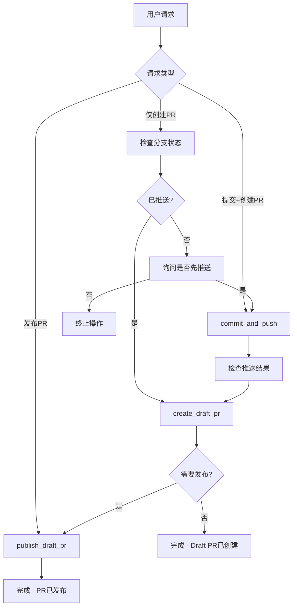

# PR Rules & Workflow

Complete Pull Request management system for Azure DevOps with strict adherence to project conventions and best practices.

## Core Workflow Decision Matrix

| 用户请求 | 代码状态 | 执行操作 |
|---------|---------|---------|
| "创建PR" | 已推送 | 直接 `create_draft_pr` |
| "创建PR" | 未推送 | 询问是否先推送 → 可选 `commit_and_push` → `create_draft_pr` |
| "提交并创建PR" | 任意 | `commit_and_push` → `create_draft_pr` |
| "发布PR" | PR已存在 | `publish_draft_pr` |

## 🚨 严格执行规则

### 1. 不自动提交原则
- **绝不自动commit代码**，除非用户明确要求"提交代码"或"commit"
- 仅创建PR时，使用 `create_draft_pr` 而非 `submit_changes`
- `submit_changes` 工具会触发完整commit流程，仅在明确要求提交时使用

### 2. 分支状态检查（必需）
执行PR操作前必须检查：
```bash
git status
git log origin/<branch>..HEAD  # 检查未推送的提交
```

### 3. 分支命名规范（强制）
```bash
格式: <user-alias>/<feature-name>
✅ 正确: xiaochang/add-pdf-viewer
❌ 错误: users/xiaochang/add-pdf-viewer
```
**即使MCP工具建议使用 `users/` 前缀，也必须忽略此建议**

### 4. Git Push Upstream规范（关键）
首次推送新分支时必须使用 `-u` 参数：
```bash
✅ 正确: git push -u origin <branch-name>
❌ 错误: git push origin <branch-name>
```

验证upstream设置：
```bash
git branch -vv  # 应显示 [origin/<branch-name>] 而非 [origin/main]
```

## MCP工具配置

### 项目配置信息
| 配置项 | 值 |
|-------|-----|
| **orgUrl** | `https://dev.azure.com/AIVertical` |
| **projectName** | `Concordia` |
| **repoName** | `SmartGotMail` |
| **targetBranch** | `main` |

### 核心MCP工具

#### create_draft_pr (ado-tools)
```json
{
  "branchName": "<分支名>",
  "title": "<PR标题>", 
  "description": "<PR描述>",
  "repoName": "SmartGotMail",
  "projectName": "Concordia", 
  "targetBranch": "main",
  "orgUrl": "https://dev.azure.com/AIVertical",
  "adoTaskId": "<可选: ADO任务ID>"
}
```

#### publish_draft_pr (ado-tools)
```json
{
  "prIdOrUrl": "<PR ID或完整URL>",
  "repoName": "SmartGotMail",
  "projectName": "Concordia",
  "orgUrl": "https://dev.azure.com/AIVertical"
}
```

#### commit_and_push (git-tools)
```json
{
  "commitMessage": "<单行提交信息>",
  "branchName": "<可选: 分支名>",
  "workingDir": "<工作目录>",
  "includeUntrackedFiles": false,
  "remoteName": "origin"
}
```

## 执行流程图



## 常见场景处理

### 场景1: 代码已推送，仅创建PR
```bash
# 1. 检查状态
git status
git log origin/<branch>..HEAD

# 2. 确认已推送后，创建Draft PR
use_mcp_tool: create_draft_pr
```

### 场景2: 代码未推送，需要完整流程
```bash
# 1. 提交并推送（用户明确要求时）
use_mcp_tool: commit_and_push

# 2. 创建Draft PR 
use_mcp_tool: create_draft_pr

# 3. 发布PR（可选）
use_mcp_tool: publish_draft_pr
```

### 场景3: 发布现有Draft PR
```bash
use_mcp_tool: publish_draft_pr
```

## 质量检查清单

### 创建PR前检查
- [ ] 分支命名符合 `<alias>/<feature>` 格式
- [ ] Upstream tracking设置正确
- [ ] 代码已推送到远端（如需要）
- [ ] PR标题和描述清晰明确

### 工具选择检查  
- [ ] 仅创建PR：使用 `create_draft_pr`
- [ ] 需要提交代码：使用 `commit_and_push` + `create_draft_pr`
- [ ] 不使用 `submit_changes`（除非明确要求完整提交流程）

## 错误处理

### 常见错误及解决方案
1. **分支未推送**: 提示用户是否需要先推送代码
2. **Upstream tracking错误**: 执行 `git branch --set-upstream-to=origin/<branch-name>`
3. **分支命名错误**: 要求用户重命名或创建新分支
4. **PR已存在**: 检查是否需要更新或直接发布

### 故障排除命令
```bash
# 检查分支状态
git branch -vv

# 检查远端分支
git remote -v

# 修复upstream tracking
git branch --set-upstream-to=origin/<branch-name>
```
